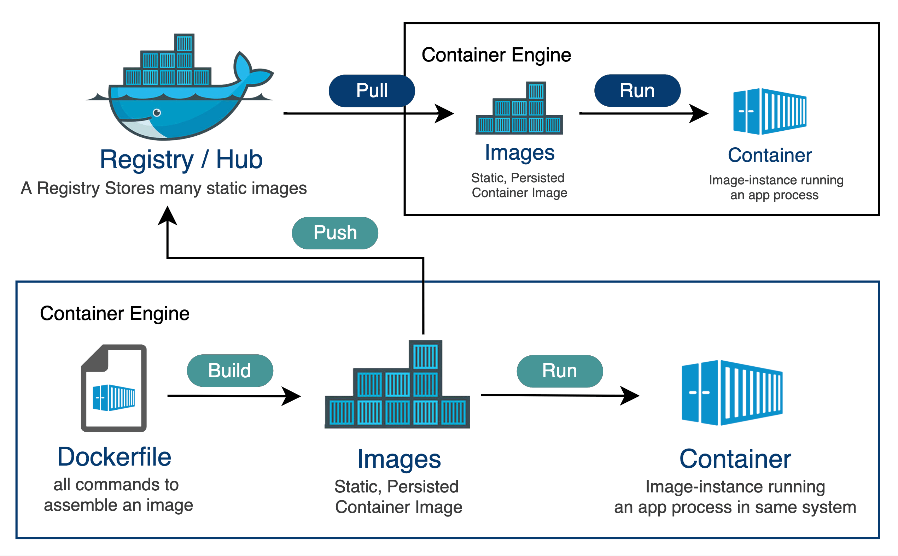

# Docker是什么
> Docker 是一个开源的**容器化平台**，开发人员可以使用该平台构建、部署、运行、更新和管理容器。

# Docker基本概念
> Docker中有三个非常重要的基本概念: 镜像(Image),容器(Container)和仓库(Repository)

## 镜像(Image):一个特殊的文件系统
> 一个特殊的文件系统,除了提供运行时提供容器所需要的程序 库 资源 配置等文件外,还包含一些为运行时准备的一些参数 比如环境变量 匿名卷 用户等 , 镜像不包含任何动态数据,其构建之后不会有任何改变 
- 分层存储
> Docker在设计时就充分利用Union FS的技术,最初设计的就是分层存储的架构
- 可复用
> 一个Image可以派生出多个容器,就像一个类可以实例化好多对象一样

## 容器(Container):镜像运行时的实体
> 镜像(Image)和容器(Container)的关系就像代码中类和实例的关系,镜像是静态的定义 容器就是镜像运行的实体,容器可以被创建 启动 停止 删除 暂停等操作
- 动态(可读写)
> 基于镜像启动后的容器会创建一个可写层,但是他是和容器生命周期一致的 也就是说容器销毁后数据也会丢失,所以不建议使用容器存储层存储任何数据
- 隔离性
> 每个容器都有自己的进程 文件系统

## 仓库(Repository):集中存放镜像的地方
> 一个 Docker Registry 中可以包含多个仓库（Repository）；每个仓库可以包含多个标签（Tag）；每个标签对应一个镜像。所以说：镜像仓库是 Docker 用来集中存放镜像文件的地方类似于我们之前常用的代码仓库。

## Image、Container 和 Repository 的关系
> 下面这一张图很形象地展示了 Image、Container、Repository 和 Registry/Hub 这四者的关系：

